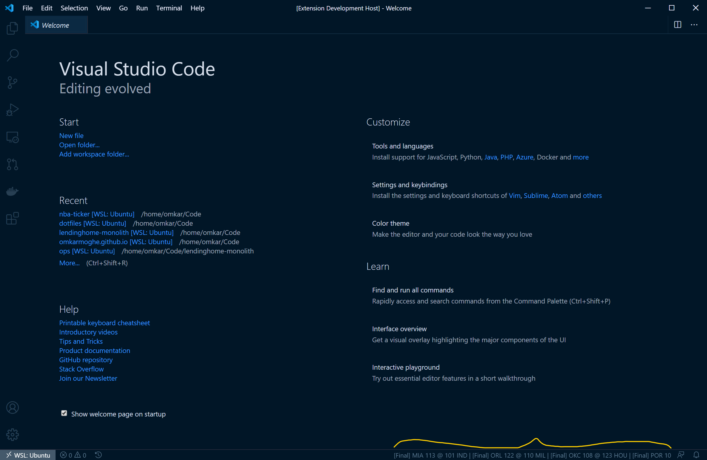

# NBA Ticker 🏀

Adds live(ish) NBA scores for today's games in your status bar. Built using the amazing [balldontlie API](https://www.balldontlie.io/#introduction). If you like this extension, please consider [donating](https://www.patreon.com/balldontlie) to them.

## Requirements

- VSCode must have a working internet connection.

## Installation

Install via the [VSCode Marketplace](https://marketplace.visualstudio.com/items?itemName=omkarmoghe.nba-ticker).

## Extension Settings

This extension contributes the following settings:

* `nba-ticker.pollSeconds`: seconds to wait before polling for new scores
* `nba-ticker.includeTeams`: array of team abbreviations to include, e.g. `["GSW", "LAL"]`
* `nba-ticker.excludeTeams`: array of team abbreviations to exclude, e.g. `["CLE", "BOS"]`

## [Changelog](./CHANGELOG.md)
